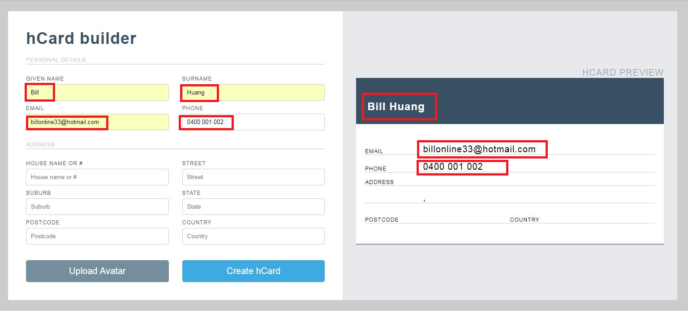
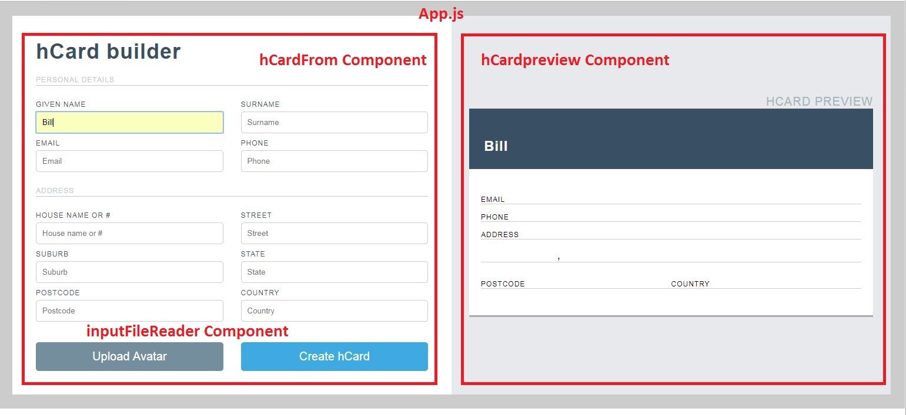

## Table of Contents

- [Introudction](#introudction)
  * [hCard Builder](#hcard-builder)
  * [Run the App](#run-the-app)
- [Main Features](#main-features)
  * [Once you open the app, you will see an empty business card entry form.](#once-you-open-the-app--you-will-see-an-empty-business-card-entry-form)
  * [Once you start to type on the left panel, the right preview panel will updatge accordingly.](#once-you-start-to-type-on-the-left-panel--the-right-preview-panel-will-updatge-accordingly)
  * [click "Upload Avatar" button, it will update the image on the preview panel.](#click--upload-avatar--button--it-will-update-the-image-on-the-preview-panel)

## Introudction

### hCard Builder

[hCard is a simple, open format for publishing people, companies and
organizations on the web](http://microformats.org/wiki/hCard).

This applciation is built in react. 

### Run the App

You can run the app from https://react-hcard-builder.herokuapp.com/ 

To run the app from your local computer, going to the project folder
    
    1. npm install
    
       this will install all required modules
       
    2. npm start
    
       This will run the app in the development mode.
       Open http://localhost:3000 to view it in the browser.
   

## Main Features

    * As the form is filled out, the preview is automatically updated
    * When the user selects an image, a thumbnail is shown in the preview
    * The app is responsive for different screen widths
      
   Once you open the app, you will see an empty business card entry form.

  

   Once you start to type on the left panel, the right preview panel will updatge accordingly.
   
   
   
   
   
   
   click "Upload Avatar" button, it will update the image on the preview panel.
   
   
    
    
   
   On my other posts, I have show many examples using redux as state management. In this example, I will show show to manage states using react only, without redux.
   
## Application Folder Structure
   
   This application is created using create-react-app. Below is the Folder Structure

hcard-builder/

      README.md

      node_modules/

      package.json

      public/

        index.html

        favicon.ico

      src/

        App.css

        App.js

        App.test.js

        index.css

        index.js

        logo.svg

        css/

          style.css

        components/

          hcardform.js

          hcardpreview.js

          inputFileReader.js

    
## Components Structure

On the top level, I have App.js.

Inside App.js, I have two components: 

HcardForm and HCardPreview.

The code is like this:

      

        <HCardForm />
        <HCardPreview />
      

## Development Consideration

Whenever a value changes in HCardForm component, it need to pass the state to HCardPreview component, and update HcardPreview component accordingly.

We know that we can pass state to component as props, we also know that state can only be passed from parent to child.

So the challenge is, how to pass state between two siblings. 

To achieve that, we need to:

### 1. Pass states from HcardForm to the parent component, which is App component.

I define state in App component first
    
      constructor(props) {
        super(props);
        this.state = {
          givenName: "",
          surname: "",
          email: "",
          phone: "",
          houseNumber: "",
          street: "",
          suburb: "",
          state: "",
          postcode: "",
          country: "",
          avatar: ""
        };
      }

I then pass the state to HCardForm compoent as props
     
        <HCardForm
          formValue={this.state}
        />
        
Whenever an input field value is changes, we need to chang state in App component. in Order to do that, we use callback function.
        
        // callback
        handleFormFieldChange(formValue) {
            this.setState(formValue);
        }
     
       <HCardForm
          formValue={this.state}
          onFormFieldChange={this.handleFormFieldChange}
        />
        
        
When there is a change in HCardForm, it calls this.props.onFormFieldChange props, and pass the updated value back to the parent (App component).
        
        
        Below is the code on how to impment this in HCardForm component:
        
            whenever there is a change on input, we call onChange={this.handleFormInputChange
            
            <input
              type="text"
              name="givenName"
              value={formValue.givenName}
              placeholder="Given Name"
              onChange={this.handleFormInputChange}
            />

          
           I then handle the event: 
          
            handleFormInputChange(event) {
                const target = event.target;
                const value = target.value;
                const name = target.name;

                this.setState(
                  {
                    [name]: value
                  },
                  /* use callback function, only call this funciton after setState is completed */
                  function() {
                    this.props.onFormFieldChange(this.state);
                  }
                );
             }
             
             note the code 
             
               this.setState(
                  {
                    [name]: value
                  },
                  /* use callback function, only call this funciton after setState is completed */
                  function() {
                    this.props.onFormFieldChange(this.state);
                  }
                );
                
                It will not work if you change the code to 
                
                 this.setState(
                  {
                    [name]: value
                  });
             
                 this.props.onFormFieldChange(this.state);
                 
                 Why? ...

### 2. Pass state from App componet to HCardPreview component

        in App.js, pass this.state as props
        
        <HCardPreview formValue={this.state} />
